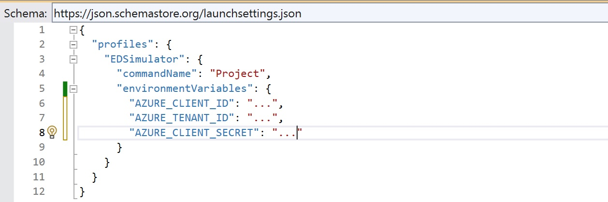

# FHIR Server

:warning: Due to the only authentication mechanism implemented so far the solution currently only integrates 
with Azure API for FHIR, however support for other FHIR servers could be easily added if required.

## Configuration

The following configuration related to the external FHIR server is specified in appsettings.json:

* Endpoint
  
  The endpoint that will be used to connect to the FHIR server.

### Example Configuration

```json
{
  "FHIRServer": {
    "Endpoint": "https://fhir.my-domain.com"
  }
}
```

## Authentication

### Azure API for FHIR

To authenticate with Azure API for FHIR, ask your FHIR server administrator (this may be you!) to setup an 
app registration and client secret, and then provide the following details:

* Azure tenant ID
* App registration client ID
* App registration client secret

These details need to be setup as environment variables on the environment that will run the 
solution. 

Setup the following environment variables:

```
AZURE_TENANT_ID: <tenant-id>
AZURE_CLIENT_ID: <client-id>
AZURE_CLIENT_SECRET: <client-secret>
```

> :warning: A client secret expires periodically, depending on the length specified when it 
> was created. Consult with your administrator on how long your secret is valid.

#### How to Set Environment Variables

Environment variables can be set in many different ways. If using an IDE such as Visual Studio
then the easiest way is to add them to launchSettings.json, so they are set when the solution is launched.



If running the solution outside of an IDE, then you can set the variables as system environment variables.

For further details, including how best to set the environment variables on different 
platforms, see the following URL: 

https://learn.microsoft.com/en-us/dotnet/azure/sdk/authentication-on-premises-apps
